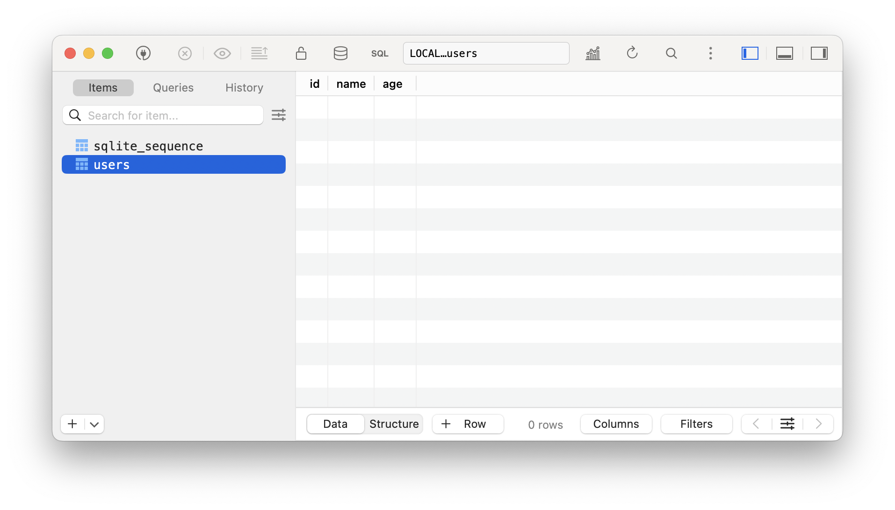
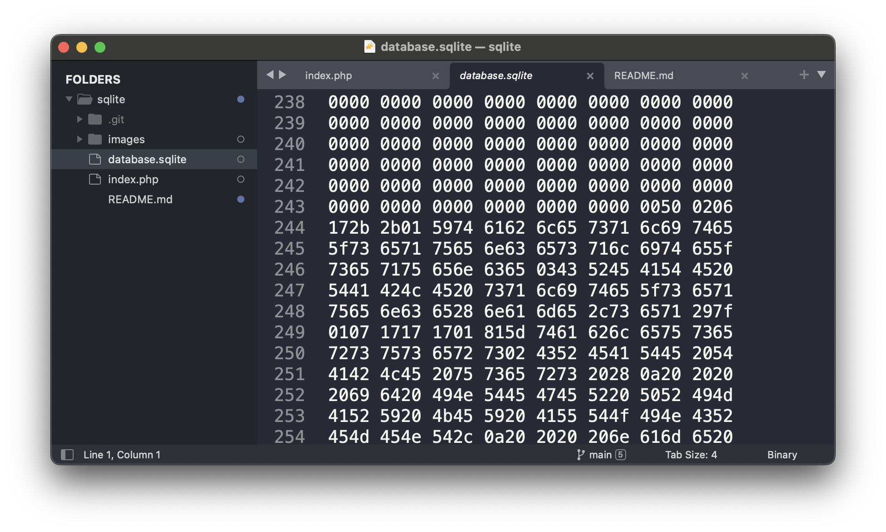
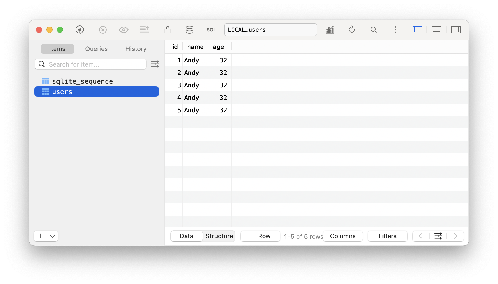
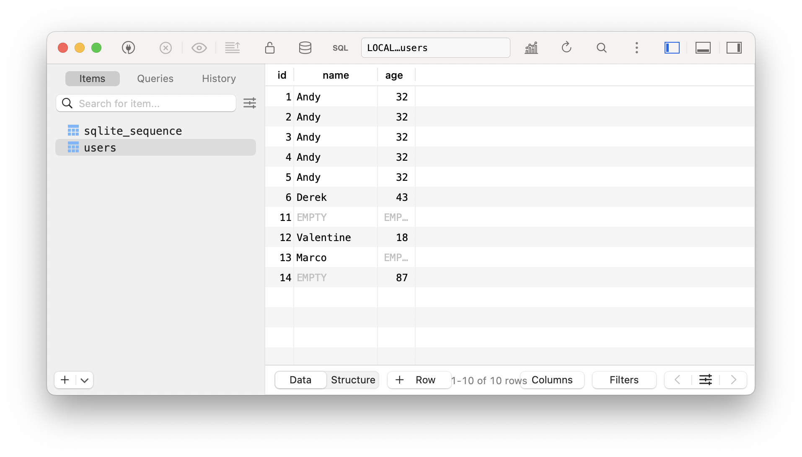

# SQLite exploration

Apparently... you can just make a file - and it's a database... and it's already built into PHP. But The docs are not very friendly or clear.

* PDO overview (introduction) https://www.php.net/manual/en/class.pdo.php
* setAttribute() method https://www.php.net/manual/en/pdo.setattribute.php
* PDO attributes and constants https://www.php.net/manual/en/pdo.constants.php
* PDO error modes https://www.php.net/manual/en/pdo.error-handling.php
* SQLite-specific PDO docs https://www.php.net/manual/en/ref.pdo-sqlite.php

Take some time to look at that. Were you able to create a database and access it yet?

On a scale from 1-10, how easy would it be for a your average developer to figure this out?

---

## What is SQLite

Created by D. Richard Hipp to be an embedded SQL database requiring minimal setup / 2000. Soon adopted in Python, PHP, and OS projects. It's used in a wide range of applications.

Zero setup, no configuration, it's just a file (well, not really) (it has a built-in engine that executes SQL), fast, you can just copy it and move it, [ACID](https://en.wikipedia.org/wiki/ACID) compliant - but uses a single write lock. MySQL and PostgresSQL support multi-thread.

When you're first learning these database concepts and tools - you're really not concerned with high-traffic situations - so, you may as well choose something that lets you focus on _learning_.

## We're using PHP - so, how do you use SQLite in that context?

You'll see "PDO" (which stands for **P**HP **D**ata **O**bjects apparently). It's a built-in PHP extension that provides a unified, object-oriented interface for interacting with databases. It acts as a database abstraction layer, meaning you can use the same functions to work with MySQL, PostgreSQL, SQLite, and other databases without changing much of your code.

### Why not just write raw SQL queries?

### Use any database with the same interface

Raw queries are tied to the specific database and PDO works for all / and you could switch types later. Gives you a unified way to fetch data.

```js
function getRecordById($table, $id) {
	// who cares how it works
	// like making any reusable things
}
```

### Security

```php
$name = $_GET['name']; 
$query = "SELECT * FROM users WHERE name = '$name'";
$result = $db->query($query);
```
Someone could mess you up! The data and the query are together. (SQL injection)

### Prepared statements / easier to read and maintain

```php
$stmt = $db->prepare("SELECT * FROM users WHERE name = ?");
$stmt->execute([$name]);
```

PDO prepares the query and the data seperatly and automatically escapes the possibly dangerous input.

(and there are some other benefits too, but you get the point)

---

## Using PDO

```php
$myAmazingDatabase = new PDO('sqlite:database-name.sqlite');

$db = new PDO('sqlite:database-name.sqlite');

// for simplicity, you might choose to use $db (but it's just a variable, right?)
```

What does this object/interface offer us?

```php
$db->setAttribute(options);
```
Customizes how PDO behaves when interacting with a database. How errors are handled, how query results are returned, etc

```php
$db->exec($sql);
```
Executes a SQL command when you don’t need results back, creating tables, inserting data, deleting things.

```php
$db->query($sql);
```
Executes a SQL query and returns results (for SELECT statements).

```php
$db->prepare($sql);
```
Prepares a SQL statement to safely accept user input.


## Structured Query Language

We should probably talk about what the `$sql`. It's the language you use to talk to the database. "Query" feels like a _question_ but it's not only for asking for and _retrieving_ data. But PDO sorta fixes that idea with it's abstraction layer.

**Core commands of SQL**

- `SELECT`: retrieves data
- `INSERT`: adds new data
- `UPDATE`: modifies existing data
- `DELETE`: removes data
- `CREATE TABLE`: sets up new tables
- `ALTER TABLE`: changes table structure

SQL keywords like SELECT, INSERT, UPDATE, etc., don’t have to be uppercase—it’s just a convention for readability.

A general "Statement" does something (creates, modifies, or removes data).
 
A "Query" asks for data.

**Example statements**

(in order if practial need)

A database is just a file until you give it some structure. The database is often already in place, but we're learning here... so, you'll have to actually create some data to work with. In SQL, you define that structure with `CREATE TABLE`. The value types and the primary key and foriegn keys and autoincrement are something we can talk about as we go.

```sql
CREATE TABLE users (
    id INTEGER PRIMARY KEY AUTOINCREMENT,
    name TEXT NOT NULL,
    age INTEGER
);
```

To use PHP, you'll need some type of LAMP stack set up. You can use MAMP or Herd or anything you want. We have a whole workshop on the options.

Use a visual interface like Sequel Pro or TablePlus to view your database.

Create a sqlite database file and an entry point (index.php) to try it out. (see our files for usage).

<picture>
	
</picture>

The sqlite file was empty before. Now look at it!

<picture>
	
</picture>

Make some other tables with other column names and practice. What if you need to delete or change one?

## Creating records

```sql
INSERT INTO users (name, age) VALUES ('Andy', 32);
```

Something like this?

```php
$db->exec("INSERT INTO users (name, age) VALUES ('Andy', 32)");

// execute this database command
// what type of command?
// where? what type of record? in what table?
// what columns?
// what values for those columns?
```

`users.create('Andy', 32);` 

might be another way you could design this - or 

`SAVE { name: "Andy", age: 32 } as USER`

(so many ways this _could_ be... but it's the way it is)

<picture>
	
</picture>

If you just write your code in the middle of the page, well - that code is going to run every time you refresh the browser (making a request to the server to run that program, right?). Notice how the `id` is automatically added and incremented.

So, it's up to you if you want to make a form - or write some logic to only create a user if it hasn't been created or something. You can also write the queries right in TablePlus or whatever db visual interface you're using (but that would be to practice SQL and not really sqlite integration via code);

Do some stuff. Practice making a bunch of records. And try to delete some?

## Progromatically creating and deleting records

Looks like we'll have to make some basic forms.

```php
$people = $db->query("SELECT * FROM users")->fetchAll();
```
The `*` here doesn't just mean "all" users -- but _all column data_ from each user too.

Get those people showing up! And consider making detail pages maybe? Or creating other tables and deleting and editing?

What happens if the fields are empty and you submit? What about when you refresh the page and it asks to resubmit and adds another person you didn't want?

<picture>
	
</picture>

## Ensuring the data is correct before it goes in the database

You can see the `NOT NULL` "constraint" added to the column in the `users` table. But that doesn't check for empty strings. So, there are some constraints on the database side but other considerations have to happen in the app logic.

Try a bunch of things out. Challenge: how could you ensure that the errors show up right next to the specific field?

Depending on your form, you might have good reason to show all of the errors at the top or bottom near the submit button. But it's good to have options. And in some cases, you might have different errors for different validations like the age being a number, bigger than 0, and not bigger than 200 or something. But - moving on.

To get the SQL errors to show, you'll need to comment out all the conditional checks for proper input, but that isn't enough. The errors won't show unless you tell them to - and that's in the `setAttribute()` world. The docs are in this case a reference with every possible option just listed with no real story for "most important", "second most important" or any practical roll-out, so it feels like you'd just _have to know_. That's a bummer! And if you'd like to help make it better, you can!

```php
$db->setAttribute(PDO::ATTR_ERRMODE, PDO::ERRMODE_EXCEPTION);

//                     setting name, value

// simple, but 
// just a bit more difficult to read because the class PDO:: and the UPPERCASE_CONSTANT yelling
```


